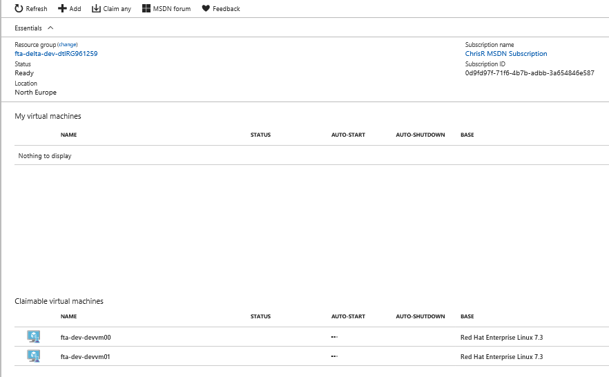
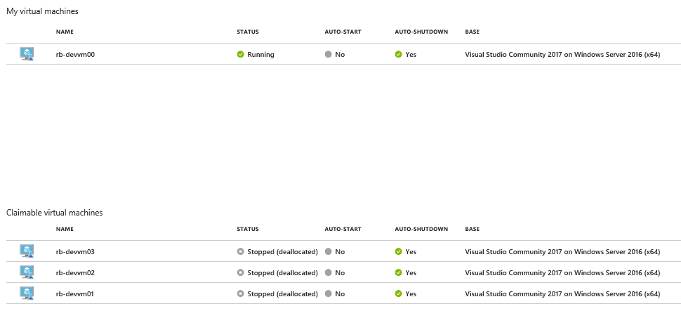
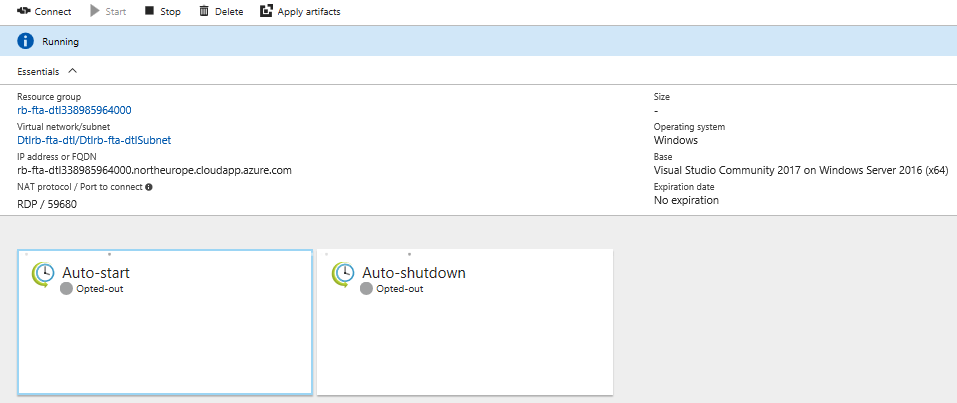
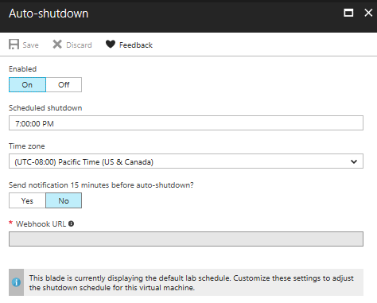
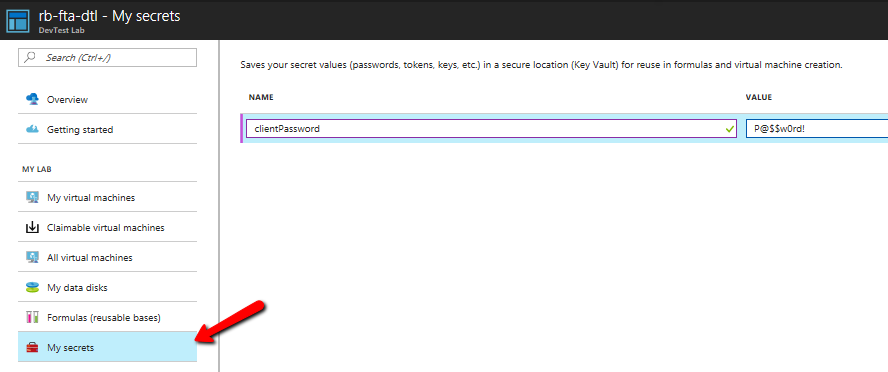
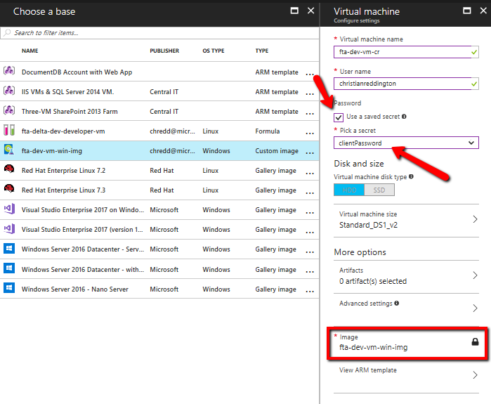
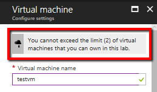
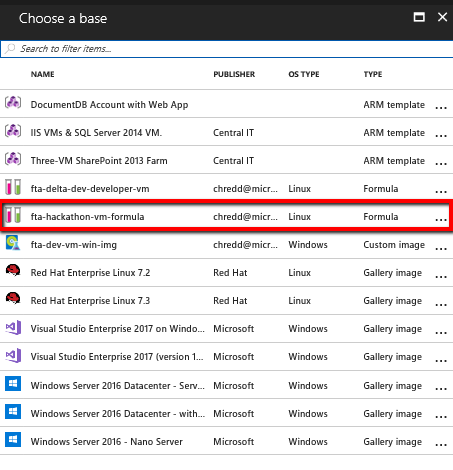

# FastTrack for Azure - DevTest Labs Developer Walkthrough

## Pre-Requisites
* You must have completed the [IT Persona Step by Step walkthrough](devtest-labs-walkthrough-it.md).

## Step by step guide

1. Open the DevTest Lab environment that was created by your IT Admins.

2. There are two sections in the main DevTest Labs dashboard.

**My Virtual Machines** -  After a VM is claimed by a user, it is moved up to their "My virtual machines" area and is no longer claimable by any other user.

**Claimable Virtual Machines** - An Azure Claimable VM is a virtual machine that is available for use by any lab user with permissions. A lab admin can prepare VMs with specific base images and artifacts and save them to a shared pool. A lab user can then claim a working VM from the pool when they need one with that specific configuration.

A VM that is claimable is not initially assigned to any particular user, but will show up in every user's list under "Claimable virtual machines". 

3. Select one of the Virtual Machines from the Claimable virtual machines section at the bottom part of the blade.

4. Select "Claim machine" at the top of the newly selected Virtual Machine's blade.

5. Within minutes, the Virtual Machine will appear under the "My virtual machines" section and is no longer available as part of the shared pool.

6. We now have a running virtual machine, that abides by the lab policies. In the screenshot below, you will notice that our lab has an Auto-shutdown policy set, but not an Auto Start policy.

7. By clicking Auto-shutdown, you will see the default lab shutdown schedule. It is possible for you to override the Auto-shutdown settings specifically for your virtual machine.

8. Navigate back to the blade for your Virtual Machine. Select Auto-start.

9. You will notice that you can adjust the settings for Auto-start. This is because the Lab Admin has enabled Auto-start policies for the DevTest Lab environment.
    * Leave this set to "Off".
    * This setting will be disabled if an Owner/Contributor has not enabled Auto-start on the DevTest Lab.

10. Navigate back to the DevTest Labs environment. Select My secrets. Create a secret by entering a name, value, and select save.

11. Browse to the overview section of your DevTest Labs environment. Create a new Virtual Machine.

12. On the list of options for Virtual Machine base, you will notice that there are a range of deployment options, in addition to Virtual Machines from the Azure Market Place and custom images. This is because our lab admin has setup a private repository, that contains ARM Templates.

13. Create a new Machine based from the custom image made by your DevTest Labs Owner/Contributor, and populate the machine details. 

14. Note, that you will be able to tick 'Use a shared secret' and use the password that you securely stored in Azure KeyVault earlier.

15. As a DevTest Lab user, we also have the ability to add artifacts to the image. Our custom image already contains a number of artifacts, so we will not add any more.

16. Create the Virtual Machine.

17. Attempt to create another Virtual Machine. Once you have selected a base, you will notice that you are unable to create the machine due to the lab policy on machine limits per user.

18. Return to your DevTest Lab blade.
    * Select Formulas (reusable bases) from the left hand navigation menu.
    * Select Add at the top of the Formulas (reusable bases) blade.

19. You would then follow the steps shown previously. First, select a base, then provide the appropriate metadata. This includes an appropriate name for your formula. Remember that other users will be able to use this formula, so you should use a name and description that accurately and succinctly describes the formula's purpose. 

Formulas, in addition to base images, provide a mechanism for fast VM provisioning. A Formula in DevTest Labs is a list of default property values used to create a lab VM. With Formulas, VMs with the same set of properties - such as base image, VM size, virtual network, and artifacts - can be created without needing to specify those properties each time. When creating a VM from a Formula, the default values can be used as-is or modified.

20. Navigate to your DevTest Labs environment. Create a new Virtual Machine. You will notice the Formula that you created in the previous step.

22. Remember, that you must be below the limit of Virtual Machines per user to be able to deploy this Formula. 

23. Congratulations, you have had a run-through of a developer or end-user experience within DevTest Labs.

## Remember

As a DevTest Labs user, you:
* Do not have permissions to create custom images.
* Do not have permissions configure policies of the lab environment.
* Do have permissions to create new Virtual Machines (up until the machine limit per user set by policy).
* My secrets are stored on a per-user basis.
* Can only delete those Virtual Machines in the DevTest Labs that belong to you. You cannot delete those in the pool, or that belong to other users.

## Useful References
* [Using VSTS to manage a virtual machine in Azure DevTest Labs](https://www.visualstudio.com/en-us/docs/build/apps/cd/azure/deploy-provision-devtest-lab)
* [Using DevTest labs as a Custom Image Factory](https://blogs.msdn.microsoft.com/devtestlab/2017/04/17/video-custom-image-factory-with-azure-devtest-labs/)
